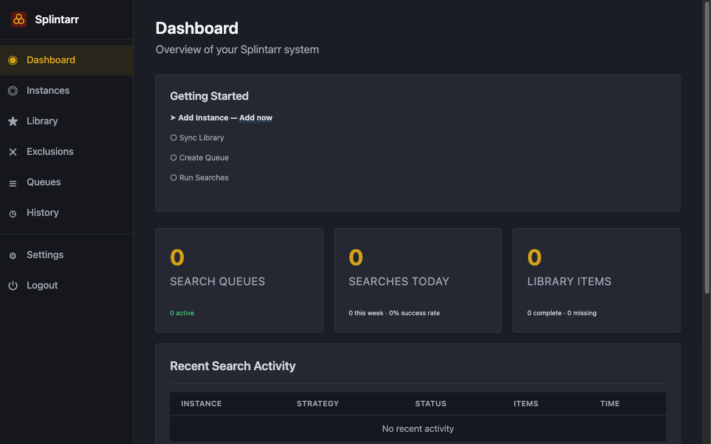
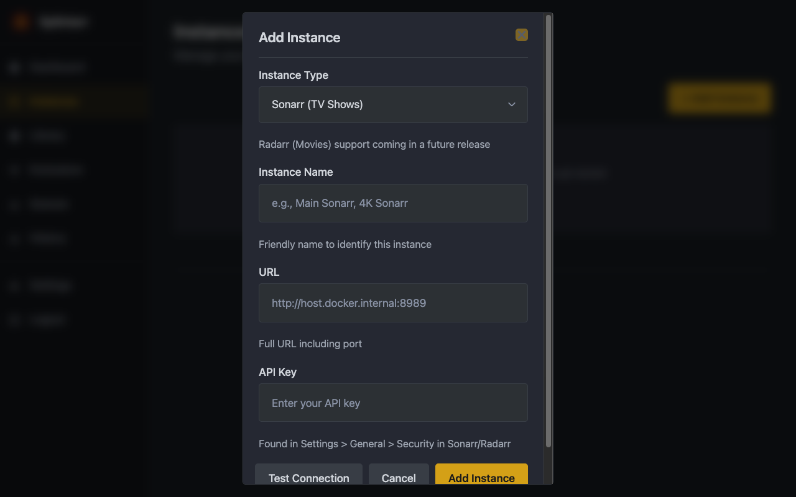
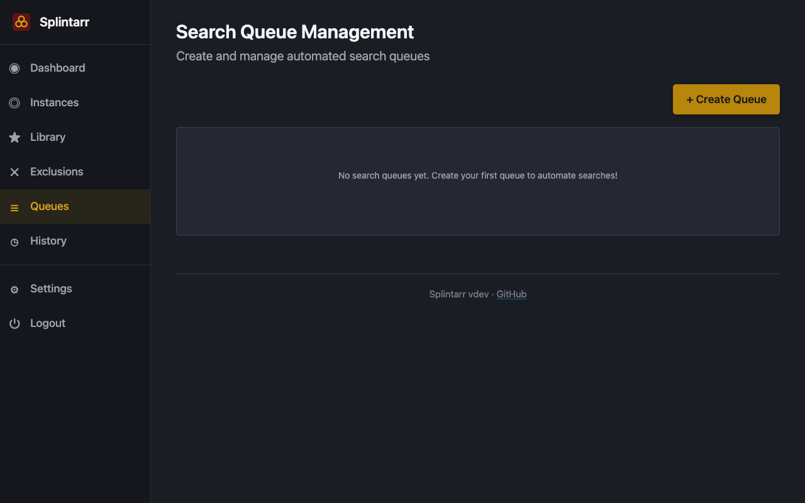
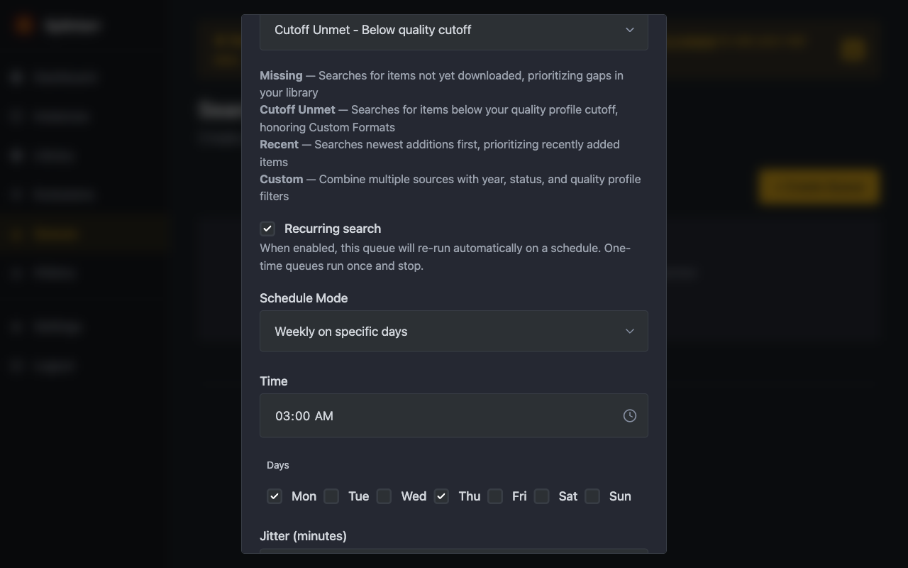
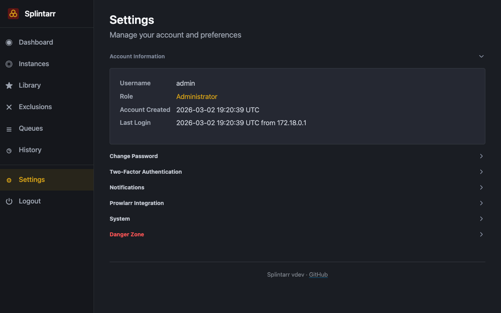
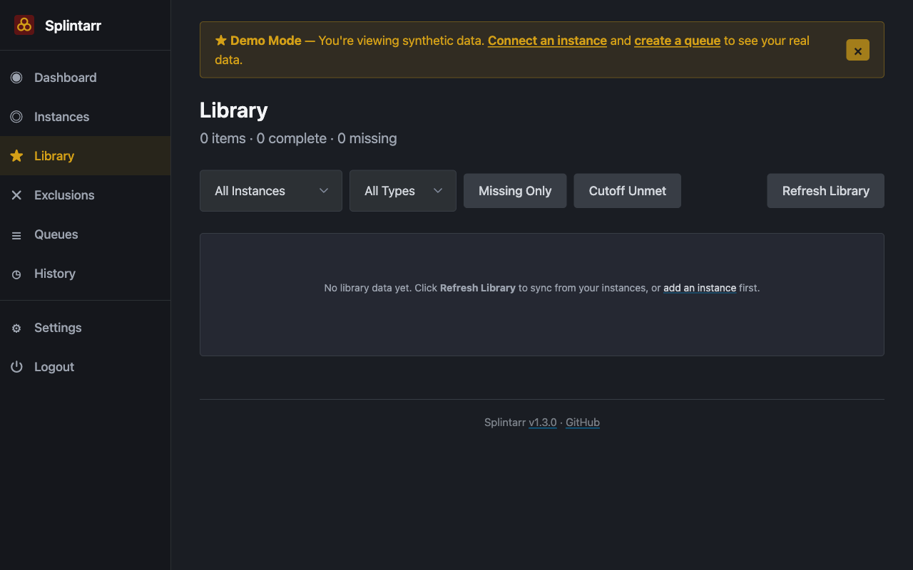
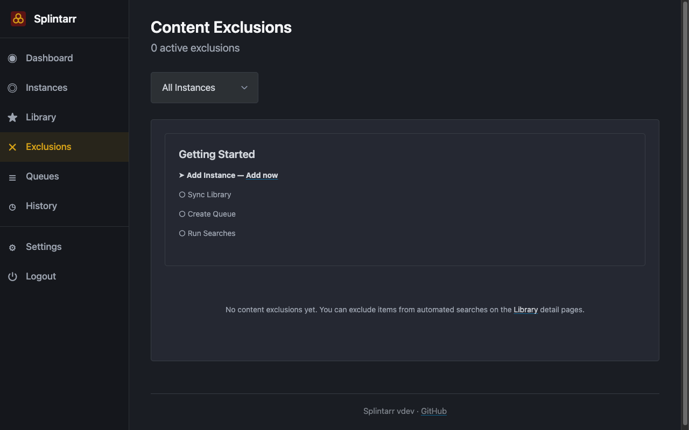
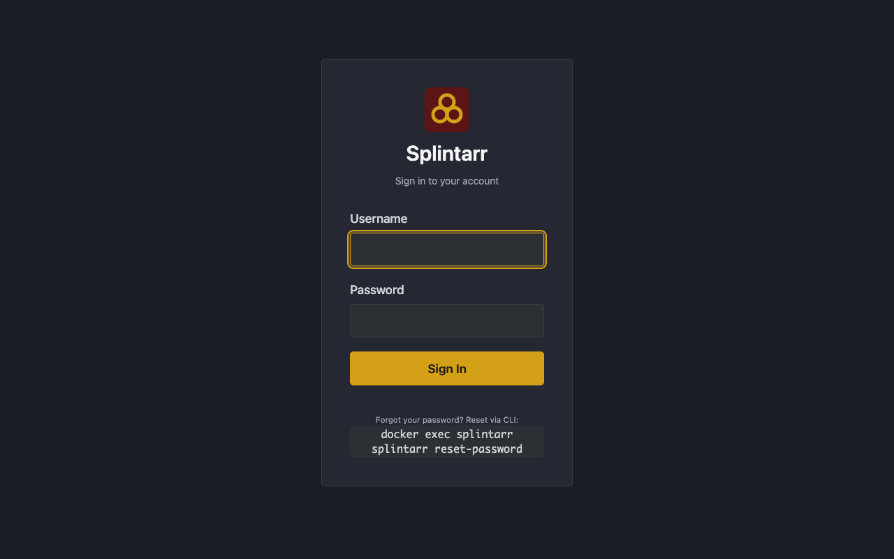

<p align="center">
  
</p>

<h1 align="center">Splintarr</h1>

<p align="center"><strong><a href="https://github.com/menottim/splintarr/releases/tag/v1.3.0">Version 1.3.0</a></strong> | Automated backlog search for Sonarr, designed for homelab use.</p>

> **Status: v1.3.0 -- Polish & Reach**
>
> Splintarr is ready for use by homelab enthusiasts. Tested on Docker Desktop for Windows; Linux and macOS Docker environments are expected to work but have not been independently verified. **Radarr support is planned for a future release; currently supports Sonarr only.** This is AI-generated code (Claude Code) — treat accordingly.

---

## Table of Contents

- [Overview](#overview)
- [Quick Start](#quick-start)
- [Documentation](#documentation)
- [Architecture Overview](#architecture-overview)
- [Development](#development)
- [Contributing](#contributing)
- [License](#license)
- [Acknowledgments](#acknowledgments)

---

## Overview

Splintarr automates systematic backlog searching for missing and upgradeable media in your Sonarr instances (Radarr support coming in a future release). It runs as a Docker container on your home network and intelligently schedules searches over time, respecting API rate limits while maximizing coverage.

### Who This Is For

This tool is designed for **homelab enthusiasts** running personal Sonarr instances who want to automate search optimization in their home environment.

### Key Features

- **Intelligent Search Scheduling** -- Multiple strategies with interval, daily, and weekly modes plus jitter
- **Custom Strategy Filters** -- Target searches by year range, quality profile, and series status with combined Missing + Cutoff Unmet
- **Search Intelligence** -- Adaptive prioritization, per-episode cooldowns, and search result feedback
- **Real-Time WebSocket Updates** -- Single connection replaces polling, with auto-reconnect and fallback
- **Live Search Progress** -- Progress bar and streaming results on queue detail, running indicator on dashboard
- **Dry Run / Preview Mode** -- See what would be searched before running, with scores and reasons
- **Search Analytics** -- Last 7 days dashboard card with trends and top searched series
- **Bulk Queue Operations** -- Multi-select with bulk pause, resume, run, and delete
- **Demo Mode** -- Synthetic data on new installs so the dashboard looks alive before setup
- **Season Pack Detection** -- Automatically searches for season packs with individual episode fallback
- **Prowlarr Integration** -- Indexer-aware rate limiting with budget progress bars and alerts
- **Series Completion Cards** -- Visual completion progress on dashboard and Library page
- **Config Import/Export** -- Backup and restore your configuration with encrypted API key re-entry
- **Library Overview** -- Visual poster grid with episode-level completion tracking
- **Content Exclusion Lists** -- Exclude specific titles from automated searches
- **Discord Notifications** -- Alerts for search activity, instance health, and queue events
- **Multi-Instance Support** -- Manage multiple Sonarr instances from one interface
- **Automatic Update Checker** -- Checks GitHub for new releases daily, dismissible dashboard banner
- **Encrypted Database** -- AES-256 encryption via SQLCipher with Fernet-encrypted API keys

---

## Quick Start

### Windows

See the **[Windows Quick Start Guide](docs/how-to-guides/windows-quick-start.md)** for step-by-step instructions.

### Linux / macOS

See the **[Docker Deployment Guide](docs/how-to-guides/deploy-with-docker.md)** for complete instructions.

**Short version:**

```bash
git clone https://github.com/menottim/splintarr.git
cd splintarr
./scripts/setup.sh --auto-start
```

Then open **http://localhost:7337** to complete the setup wizard.

After installation, see the **[Getting Started Tutorial](docs/tutorials/getting-started.md)** for a walkthrough of the setup wizard, dashboard, and creating your first search queue.

---

## Documentation

Documentation is organized following the [Diataxis](https://diataxis.fr/) framework:

### Tutorials (Learning-Oriented)

- **[Getting Started](docs/tutorials/getting-started.md)** -- Post-install walkthrough: setup wizard, dashboard, first search queue

### How-To Guides (Problem-Oriented)

- **[Windows Quick Start](docs/how-to-guides/windows-quick-start.md)** -- Install and run on Windows with Docker Desktop
- **[Deploy with Docker](docs/how-to-guides/deploy-with-docker.md)** -- Deploy using Docker and Docker Compose on Linux/macOS
- **[Backup and Restore](docs/how-to-guides/backup-and-restore.md)** -- Protect and recover your data
- **[Upgrade](docs/how-to-guides/upgrade.md)** -- Upgrade to new versions
- **[Troubleshoot](docs/how-to-guides/troubleshoot.md)** -- Solve common problems

### Reference (Information-Oriented)

- **[API Reference](docs/reference/api.md)** -- Complete REST API documentation
- **[Configuration Reference](docs/reference/configuration.md)** -- All configuration options and environment variables
- **[Quality Gates](docs/reference/quality-gates.md)** -- Testing and quality standards

### Explanation (Understanding-Oriented)

- **[Architecture](docs/explanation/architecture.md)** -- System design and architectural decisions
- **[Security](docs/explanation/security.md)** -- Security model, implementation details, and [accepted risks](docs/explanation/security.md#known-limitations-and-accepted-risks)
- **[Search Strategies](docs/explanation/search-strategies.md)** -- How different search strategies work

### Release Information

- **[Release Notes v1.3.0](RELEASE_NOTES.md)** -- What's in the current release
- **[Release History](https://github.com/menottim/splintarr/wiki/Release-History)** -- Complete version history

### Screenshots

| Dashboard | Instance Management |
|:-:|:-:|
|  |  |
| **Search Queues** | **Queue Scheduling** |
|  |  |
| **Settings & Notifications** | **Library** |
|  |  |
| **Exclusions** | **Login** |
|  |  |

---

## Architecture Overview

Splintarr is built with:

- **FastAPI** -- Async web framework serving the UI and REST API
- **SQLAlchemy + SQLCipher** -- ORM with encrypted database storage
- **APScheduler** -- Background job scheduling for search queues
- **httpx** -- Async HTTP client for communicating with Sonarr APIs (Radarr planned)
- **Argon2id** -- Password hashing
- **Pydantic** -- Input validation and configuration management

The application runs as a single Docker container with a SQLite/SQLCipher database stored in a mounted volume. See **[Architecture](docs/explanation/architecture.md)** for the full design.

---

## Development

### Running Tests

```bash
poetry install
poetry run pytest

# Security tests only
poetry run pytest tests/security/

# With verbose output
poetry run pytest -v
```

### Code Quality

```bash
poetry run ruff check src/
poetry run mypy src/
poetry run bandit -r src/
```

---

## Contributing

This is primarily a demonstration and educational project. Contributions are welcome:

- **Security Issues** -- See [SECURITY.md](SECURITY.md) for how to report vulnerabilities privately via GitHub Security Advisories.
- **Bugs and Improvements** -- Open a pull request with your changes.
- **Code Review** -- All contributions welcome, especially from security professionals.

## License

MIT License -- Use at your own risk. See LICENSE file for details.

**By using this software, you acknowledge:**
- This is AI-generated code requiring professional security review
- No warranty or guarantee of security or fitness for any purpose
- You assume all responsibility for any use of this software

## Acknowledgments

- **100% Generated by Claude Code (Anthropic)** -- AI pair programming tool
- Built with lessons learned from the [Huntarr security incident](https://github.com/rfsbraz/huntarr-security-review)
- Implements specifications based on OWASP Top 10 2025 and NIST password storage guidelines

### AI-Generated Code Warning

**This project was 100% "vibe coded" using AI assistance (Claude Code).** This codebase is **NOT production-ready, NOT security-reviewed, and NOT battle-tested**. AI-generated code may contain security flaws, logic errors, and bugs that appear correct but are fundamentally broken.

**Use at your own risk.** This is an **educational project for homelab tinkering only**. Do not expose this application to the internet without extensive professional security review and testing.

### About the Author and Security Approach

I am a **Security Engineering professional** with expertise in infrastructure security and privacy engineering. At this stage of my career, I spend most of my time leading teams rather than writing code. While I have a solid understanding of software development practices and security principles, I am **not an expert Security Software Engineer**.

During this vibe-coding exercise, I made every effort to implement security best practices by drawing on my professional knowledge. However, there is a **significant difference** between understanding security principles and correctly implementing them in code. The combination of AI-generated code, implementation by a security professional rather than a specialized secure development expert, and lack of professional security code review means this codebase should be treated as an educational exercise, not production software.
