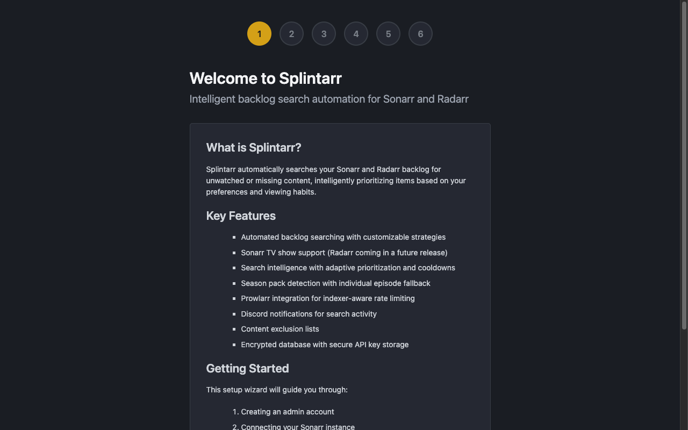
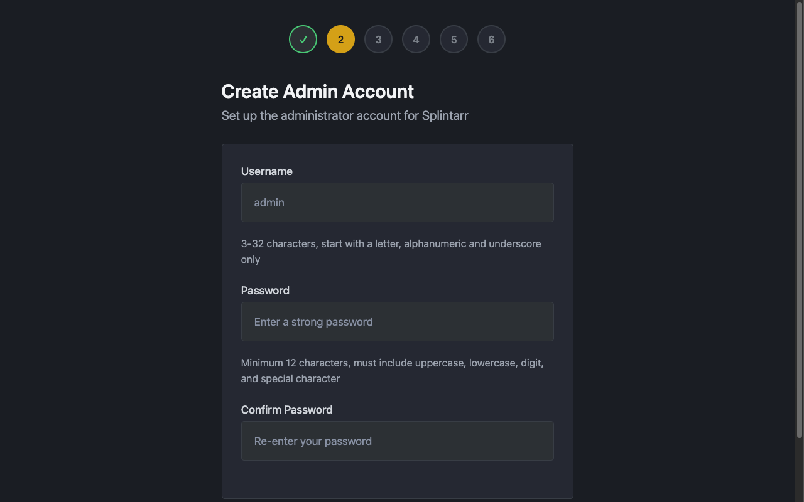
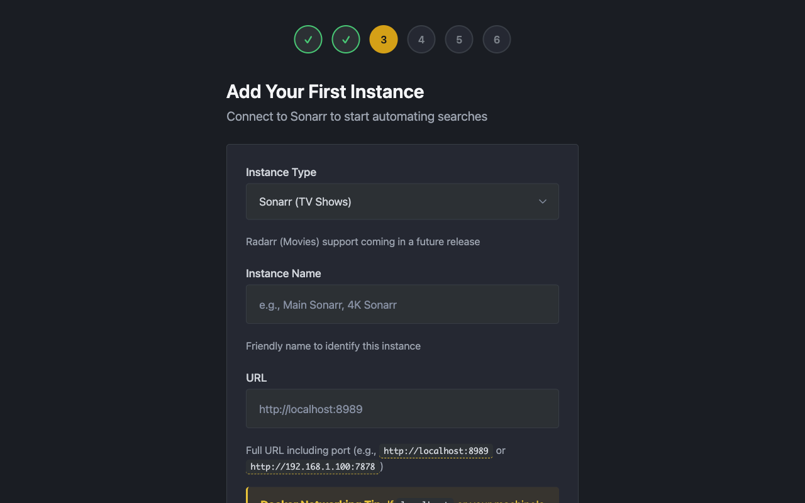
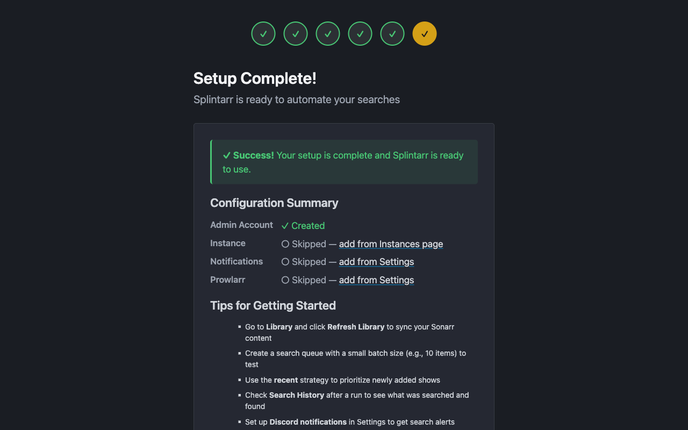

# Getting Started

**Splintarr v0.1.0-alpha**

This tutorial walks you through the post-install experience: completing the setup wizard, understanding the dashboard, creating your first search queue, and checking search history.

**This guide assumes you already have the Docker container running.** If you have not installed the application yet:

- **Windows users:** Follow the [Windows Quick Start Guide](../how-to-guides/windows-quick-start.md)
- **Linux/macOS users:** Follow the [Docker Deployment Guide](../how-to-guides/deploy-with-docker.md)

---

## Step 1: Complete the Setup Wizard

Open your browser and go to **http://localhost:7337/setup** (or substitute your server's IP address).



### Create Your Admin Account

- Choose a username (3-50 characters)
- Set a strong password (minimum 12 characters, mix of uppercase, lowercase, numbers, and symbols)
- Confirm your password



Click **Create Account** to continue.

### Add Your First Sonarr or Radarr Instance

You will need the URL and API key for at least one Sonarr or Radarr instance on your network.

| Field | Description | Example |
|-------|-------------|---------|
| **Name** | A friendly label for this instance | "Main Sonarr" |
| **Type** | Sonarr or Radarr | Sonarr |
| **URL** | Full URL including port | `http://192.168.1.100:8989` |
| **API Key** | From your instance's settings | `abc123def456...` |

**Where to find your API key:**

- **Sonarr:** Settings > General > Security > API Key
- **Radarr:** Settings > General > Security > API Key



Click **Test Connection** to verify, then **Add Instance**.

### Finish Setup

The wizard will confirm everything is configured. Click **Go to Dashboard** to proceed.



---

## Step 2: Understand the Dashboard

After setup, you land on the main dashboard.


It shows:

- **Instance Status** -- Health and connectivity of each Sonarr/Radarr instance
- **Active Search Queues** -- Any currently running or scheduled searches
- **Recent Searches** -- Search activity from the last 24 hours
- **Statistics** -- Total searches, success rate, and items found

The navigation bar gives you access to:

- **Dashboard** -- Overview and statistics
- **Instances** -- Manage Sonarr/Radarr connections
- **Search Queues** -- Create and manage automated searches
- **Search History** -- View past search results
- **Settings** -- Account and application settings

---

## Step 3: Create Your First Search Queue

A search queue tells Splintarr what to search for and when.

Go to **Search Queues** and click **Create Queue**. Fill in the following:


| Field | Description | Recommendation |
|-------|-------------|----------------|
| **Name** | Descriptive label | "Daily Missing Search" |
| **Instance** | Which Sonarr/Radarr to search | Select the instance you just added |
| **Strategy** | What to look for | Missing |
| **Schedule** | When to run | Daily at 2:00 AM |
| **Items per Batch** | How many items per run | 50 |

### Search Strategies

- **Missing** -- Search for episodes or movies that are completely missing
- **Cutoff Unmet** -- Search for upgrades to content that does not meet your quality profile cutoff
- **Recent** -- Search only recently added content
- **Custom** -- Advanced filtering by tags, quality, and other criteria

Click **Create Queue** to save. The queue will run automatically on its schedule.

### Example Queues

**Daily missing content search:**
```
Name: Daily Missing
Strategy: Missing
Schedule: 0 2 * * * (2 AM daily)
Batch Size: 50
```

**Weekly quality upgrade:**
```
Name: Weekend Upgrades
Strategy: Cutoff Unmet
Schedule: 0 2 * * 6 (Saturday 2 AM)
Batch Size: 30
```

---

## Step 4: Check Search History

Go to **Search History** to see what Splintarr has done. Each entry shows:

- Date and time of the search
- Which instance was searched
- The search strategy used
- The specific item searched (episode or movie)
- Whether the search succeeded or failed
- How many downloads were found

### Cooldown Period

Once an item is searched, it will not be searched again for 24 hours. This prevents overwhelming your indexers with duplicate requests.

---

## Tips for Best Results

**Stagger search schedules** if you have multiple instances:
- Instance 1 queue: 2:00 AM
- Instance 2 queue: 3:00 AM
- Instance 3 queue: 4:00 AM

**Adjust batch sizes** based on your indexer capacity:
- More indexers: higher batch size is fine
- Fewer indexers: keep batch size lower (10-20)

**Use different strategies** for different goals:
- Missing: run daily
- Cutoff Unmet: run weekly
- Recent: run every 6 hours

---

## Next Steps

- **[Troubleshooting](../how-to-guides/troubleshoot.md)** -- Solutions for common problems
- **[Backup and Restore](../how-to-guides/backup-and-restore.md)** -- Protect your data
- **[Configuration Reference](../reference/configuration.md)** -- All configuration options
- **[Search Strategies](../explanation/search-strategies.md)** -- How strategies work in detail
- **[API Reference](../reference/api.md)** -- REST API documentation
- **[Upgrade Guide](../how-to-guides/upgrade.md)** -- Keeping up to date
